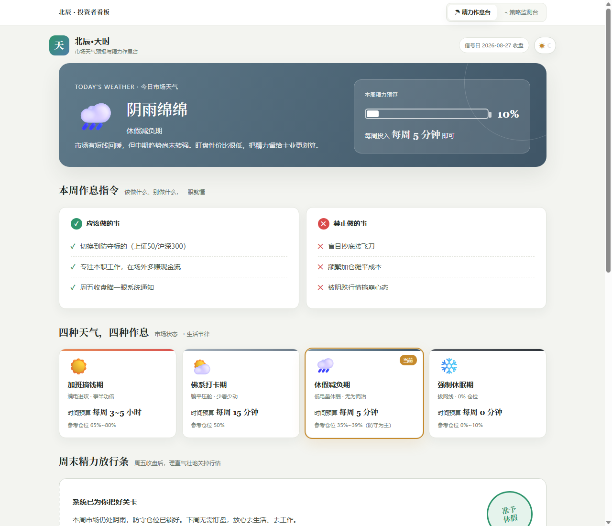
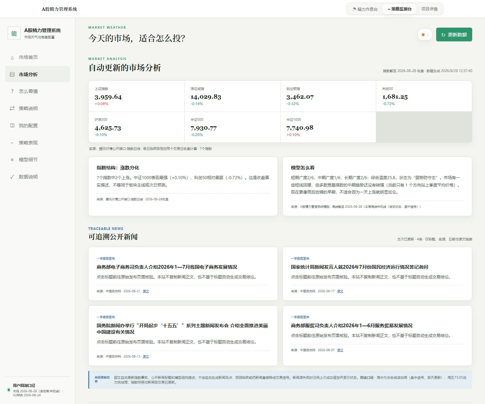

# A股精力管理系统

用6只核心宽基的趋势广度判断市场天气，把仓位纪律与盯盘精力放进同一套规则里。





## 这是什么

这是一个纯 HTML / CSS / JavaScript 的 A 股市场状态研究原型，提供两个入口：

- `tianshi.html`：面向普通投资者的精力作息台，把市场状态翻译为时间预算、行动与禁止事项。
- `index.html`：面向进阶使用者的策略监测台，展示6只ETF对应宽基的广度、V1/V2 规则、ETF 配置、样例回测和数据审计。
- `project.html`：适合项目展示和 GitHub Pages 的图文详情页。

项目不依赖框架或后端，下载后可直接打开；维护数据需要 Node.js 20+，不需要安装第三方包。

## 核心模型

系统观察上证50、沪深300、中证500、中证1000、创业板指、科创50：

1. 分别判断周收盘是否站上 MA4、MA12、MA24。
2. 计算短、中、长期市场广度。
3. 使用 `综合广度 = 35% × B4 + 45% × B12 + 20% × B24`。
4. 把市场分为多头、震荡、防守、危机。
5. V2 根据状态决定总仓位，再用复合动量、Top 3 迟滞和 MA4 六折平抑选择标的与控制风险。

完整规则见 [V1 指南](./docs/v1-regime-identification-guide.md) 与 [V2 框架](./docs/v2-comprehensive-framework.md)。

## 快速开始

### 直接打开

下载仓库后打开 `tianshi.html`。浏览器会读取已烘焙的周线和样例回测，不需要本地服务。

### 本地服务

部分浏览器安全策略较严格时，可在仓库根目录运行：

```bash
python -m http.server 8000
```

然后访问 `http://localhost:8000/project.html`。

### 更新市场数据

```bash
cp config/data-source.example.json config/data-source.json
node scripts/update-data.mjs
node scripts/validate.mjs
```

Windows PowerShell 可用：

```powershell
Copy-Item config/data-source.example.json config/data-source.json
node scripts/update-data.mjs
node scripts/validate.mjs
```

更新完成后刷新 `tianshi.html`（精力作息台）和 `index.html`（策略监测台）。`data/history-baked.js` 驱动宽基周线、市场状态和内部对照回测；`data/market-analysis.js` 驱动7个指数收盘快照、可追溯公开新闻标题及模型结构描述。默认新闻源为中国政府网一手政务发布，只保存标题、日期、来源和原文链接，不复制正文。

**更新频率与时间口径（可按天更新）**：

- 周一至周四运行：数据商返回尚未收线的当周周线，页面取**滚动周线（未收线·盘中状态）**计算市场状态，并明确标注；因此每天更新都能看到当日最新信号。
- 周五 14:30—14:45（调仓窗口）：可手动运行脚本拿到**当日盘中滚动信号**用于核对与调仓；页面交易单会在该时段提示更新。
- 周五 15:05 后运行：当周周线已收线，页面标注**完成周**，为最终周线。
- 数据文件中的 `weekState` 字段（`rolling` / `completed`）和 `asofWeekEnd`（该周周五）即用于此口径标注，校验脚本会锁定该契约。

**GitHub Pages 自动更新**：仓库内置 `.github/workflows/update-data.yml`，工作日北京时间 14:35 自动运行更新并提交推送（有数据变化才提交），随后自动触发 Pages 部署；也可在仓库 Actions 页手动点击 `Update market data` → `Run workflow`，随时按最新滚动周线更新，周五 14:30 调仓前可用。

用户V2净值与年度归因是独立的静态回测样例，固定区间为 `2023-01-02` 至 `2026-08-24`（187周），不会被公开行情更新脚本延长或重算。数据配置、滚动周/完成周口径、新闻缓存降级和供应商替换边界见 [数据接入说明](./docs/DATA.md)。

## 样例回测

仓库包含 2023-01-02 至 2026-08-24 的 187 周 V2 静态样例 CSV。页面按净值序列复算：累计收益 +47.4%、几何年化 +11.2%、最大回撤 -10.8%、年化波动 16.6%、夏普 0.74、卡玛 1.04。年度归因同样固定截至2026-08-24，不会随市场数据自动更新。

这些数字不是实盘业绩。回测采用最终周收盘信号并假设同收盘价成交，可能低估滑点并含同收盘成交偏差。样例 CSV 的生成链路不在本仓库内完整复现，使用前应独立审计。

## 目录

```text
.
├── project.html              # 图文项目详情
├── readme.html               # 浏览器可读的README页面
├── tianshi.html              # 精力作息入口
├── index.html                # 策略监测台
├── app.js / styles.css       # 策略台逻辑与样式
├── data/                     # 浏览器数据与样例回测
├── config/                   # 数据源配置模板
├── scripts/                  # 更新与校验脚本
├── docs/                     # 模型、数据、架构与风险文档
└── assets/screenshots/       # README 与详情页截图
```

## 验证

```bash
node --check app.js
node --check scripts/update-data.mjs
node --check scripts/validate.mjs
node scripts/validate.mjs
```

## 数据与合规边界

- 默认腾讯行情适配器属于非官方公开接口，没有稳定性或长期可用性保证。
- 仓库不包含账户、密钥、交易接口或自动下单能力。
- 行情、策略信号和样例回测仅供研究与产品原型验证，不构成投资建议。
- 任何策略都可能失效，过往表现不预示未来收益。

详见 [免责声明](./docs/DISCLAIMER.md)、[安全说明](./SECURITY.md) 与 [贡献指南](./CONTRIBUTING.md)。

## License

代码以 [MIT License](./LICENSE) 发布。第三方行情数据及其接口的使用受原提供方条款约束，不因本项目许可证而获得再授权。
