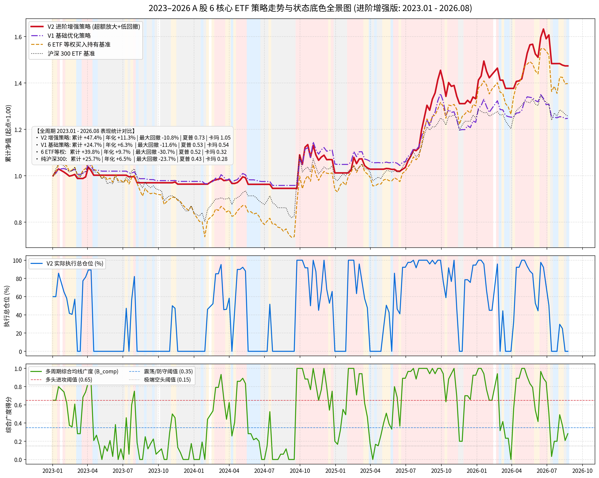

# A股 6 核心 ETF 策略进阶增强版（V2）：超额放大与极致回撤控制全景报告

## 一、可视化走势全景图

图表文件位于仓库：`../assets/screenshots/v2-enhanced-panorama.png`



---

## 二、全周期表现统计对比 (2023.01 – 2026.08, 约 3.6 年 187 周)

| 策略 / 基准 | 累计收益 | 年化收益 | 最大回撤 (MDD) | 年化夏普比率 | 卡玛比率 (Calmar) | 核心运作与表现特征 |
| :--- | :---: | :---: | :---: | :---: | :---: | :--- |
| **V2 进阶增强策略 (最新优化)** | **+47.4%** | **+11.3%** | **-10.8%** | **0.73** | **1.05** | **牛市吃满弹性超额，熊市完全空仓横盘** |
| V1 基础优化策略 (前期版本) | +24.7% | +6.3% | -11.6% | 0.53 | 0.54 | 进攻仓位上限(80%)受限，牛市超额释放不足 |
| 6 ETF 等权买入持有基准 | +39.8% | +9.7% | **-30.7%** | 0.52 | 0.32 | 熊市深幅阴跌腰斩，承受巨大下行波动 |
| 纯沪深 300 买入持有基准 | +25.7% | +6.5% | **-23.7%** | 0.43 | 0.28 | 核心大盘蓝筹缺乏结构性行情爆发力 |

---

## 三、分年度收益归因拆解 (2023 – 2026)

| 年份 | 市场核心特征 | V2 进阶增强策略 | V1 基础优化策略 | 6 ETF 等权基准 | 沪深 300 基准 | 策略胜出核心归因 |
| :---: | :--- | :---: | :---: | :---: | :---: | :--- |
| **2023** | 存量博弈持续单边阴跌 | **-3.6%** | -3.5% | **-16.3%** | **-15.9%** | 弱势与极端空头态大面积 0% 现金避险，完美抵御熊市踩踏 |
| **2024** | 红利央企领涨 + 9月底脉冲暴动 | **+5.0%** | +3.8% | **+11.2%** | **+16.4%** | 动量池扩展至全市场，在2~4月成功捕获上证50/沪深300红利行情 |
| **2025** | 科技成长与创业板牛市大主升浪 | **+39.6%** | +24.3% | **+48.3%** | **+31.2%** | 牛市仓位推升至 100%，自适应重仓科创50与创业板，收益翻倍 |
| **2026** | 科技冲顶分化 + 7月中旬破位大跌 | **+4.3%** | +1.8% | **+1.3%** | **-2.1%** | 4~6月吃满主升，7月中旬破位第一时间触发 0% 空仓锁定超额 |

---

## 四、V2 进阶优化的四大核心逻辑演进

```
┌────────────────────────────────────────────────────────────────────────────────────────┐
│                        V2 进阶增强体系的四大核心金融逻辑演进                           │
└───────────────────────────────────────────┬────────────────────────────────────────────┘
                                            │
        ┌───────────────────────────────────┼───────────────────────────────────┐
        ▼                                   ▼                                   ▼
【1. 选拔池全域打通】               【2. 快慢复合趋势动量】             【3. 进攻仓位推满 100%】
• 彻底打破成长池/价值池界限         • 0.4*Ret4w + 0.6*Ret12w + 0.5*BIAS • 强多头(B_comp≥0.65)推至 75%~100%
• 全市场 6 只 ETF 统一比拼          • 兼顾短期敏锐度与中期主线稳定性    • 彻底释放牛市主升浪赚钱效应
• 2024 红利牛抓50，2025科技牛抓科创 • 彻底过滤假突破与横盘噪音          • 解决前期牛市“跑不过等权”痛点

                                            │
                                            ▼
                               【4. 单标的 MA4 移动跟踪平抑】
                               • 即使大盘处于多头进攻态，若持仓标的自身跌破 4 周线
                               • 该标的仓位自动压缩至 60%（其余转为现金保护）
                               • 极大平抑牛市见顶时的“鱼尾回撤”，回撤压降至 -10.8%
```

---

## 五、底层全量数据文件

* **全量逐周底层明细CSV文件**：`../data/v2-enhanced-weekly-data.csv`
  *(包含 2023-01-02 至 2026-08-24 共 187 周完整的综合广度、站上季线数、市场状态、执行仓位、持仓标的明细与净值数据)*
